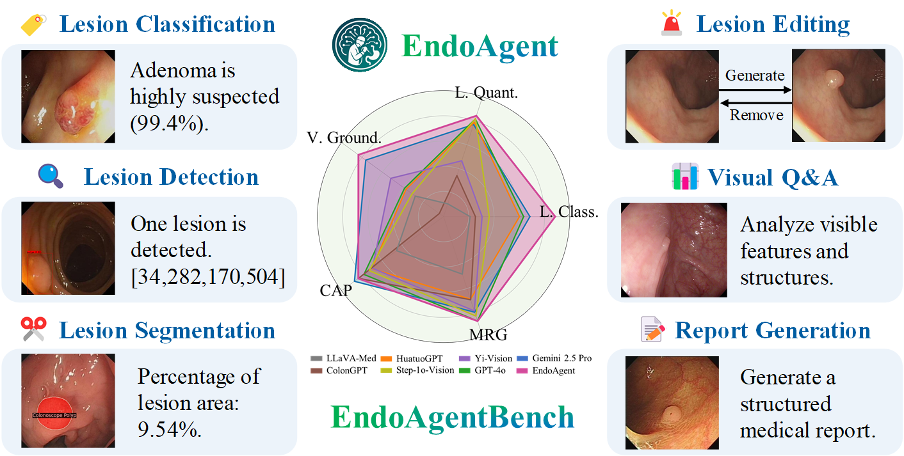

# EndoAgent - Endoscopic AI System

## Project Overview
EndoAgent is a multimodal AI system for endoscopic image analysis, supporting image classification, detection, segmentation, polyp generation/removal, visual question answering, and automated report generation. The system integrates multiple deep learning tools and provides a user-friendly Gradio interface.

<p align="center">
  
</p>

*Overview of EndoAgent as shown above.*

## Dataset Preparation
Dataset preparation scripts are located in the `data_prepare/` folder, with separate subfolders for visual tasks (`visual_task/`) and language tasks (`language_task/`). Each contains scripts for data generation and conversion.

## Main Components
- `endoagent/`: Core system, including model components, prompt documents (`docs/system_prompts.txt`), downstream toolsets (`tools/`), and model weight configurations.
- `endoagent/tools/`: Implements tools for classification, detection, segmentation, polyp generation/removal, visual question answering, and report generation.
- `endoagent/docs/system_prompts.txt`: System prompts and tool descriptions.

## Evaluation
Evaluation scripts are located in the `evalutaion/` folder, divided into visual tasks (`visual_tasks/`) and language tasks (`language_task/`), for model performance assessment.

## Interface
- Supports both Chinese and English interfaces: `interface_zh.py` (Chinese) and `interface_en.py` (English).
- Run `gradio.py` to launch the Gradio web interface for interactive experience.

<p align="center">
  
</p>

*Animated demo of the Gradio web interface.*

## Environment Setup
Conda is recommended:
```bash
conda env create -f environment.yaml
conda activate endoagent
```
To install only Python dependencies:
```bash
pip install -r requirements.txt
```
For OpenAI API access, set the environment variable:
```bash
export OPENAI_API_KEY=your_key_here
```

## Quick Start
1. Install dependencies (see requirements.txt or environment.yaml)
2. Set OpenAI API key (if needed)
3. Run `python gradio.py`
4. Access the system at `http://0.0.0.0:8686` in your browser

## File Structure
- `data_prepare/`: Data generation and processing scripts
- `endoagent/`: Model components, toolsets, prompt documents
- `evalutaion/`: Evaluation scripts
- `interface_zh.py` / `interface_en.py`: Chinese/English interfaces
- `gradio.py`: Gradio main interface entry

## Notes
- GPU is recommended for best performance
- Ensure model weights and configuration file paths are correct

